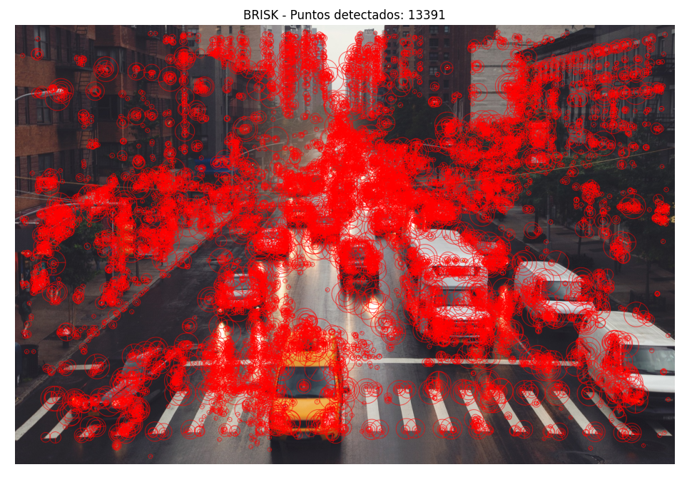
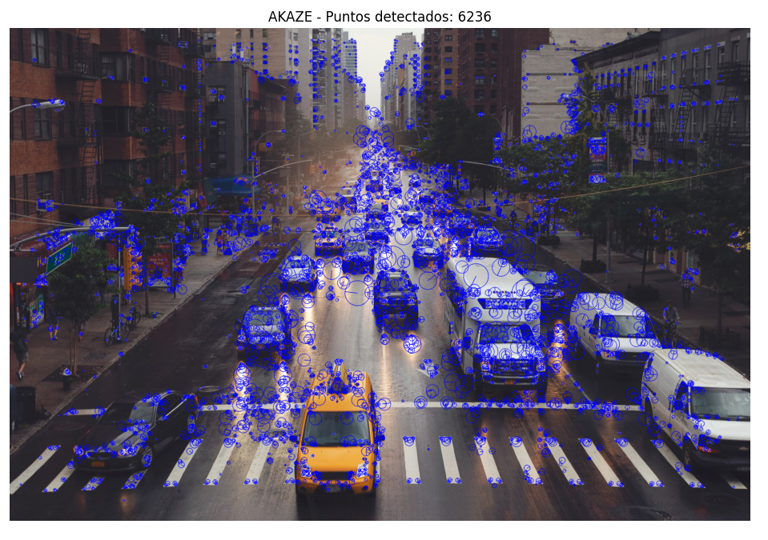

# Práctica de Laboratorio: Detección de Características en Imágenes

##  Contextualización

En esta práctica se desarrolló un ejercicio de visión por computadora enfocado en la detección de características en imágenes digitales. Este tipo de procesamiento es fundamental en aplicaciones como la realidad aumentada, reconocimiento de objetos e interfaces inteligentes. Se aplicó un filtro gaussiano como etapa de preprocesamiento con el objetivo de reducir el ruido de la imagen y mejorar la calidad en la detección de características. Posteriormente, se implementaron algoritmos de detección de puntos clave como SIFT, SURF y ORB, con el fin de analizar su comportamiento y comparar su desempeño en la identificación de características relevantes dentro de la imagen.

---

##  Objetivo

Comparar el funcionamiento de diferentes algoritmos de detección de características (SIFT, SURF y ORB) aplicados a una imagen, evaluando su desempeño en términos de cantidad de puntos detectados, precisión y eficiencia.

---

##  Algoritmos utilizados

### 🔸 Filtro Gaussiano
El filtro gaussiano es una técnica de procesamiento de imágenes utilizada para suavizar la imagen y reducir el ruido. Esto permite mejorar la detección de características, evitando que los algoritmos identifiquen detalles irrelevantes.


---

### 🔸 SIFT (Scale-Invariant Feature Transform)
SIFT es un algoritmo robusto que detecta puntos clave invariantes a escala y rotación. Es altamente preciso y permite identificar características importantes incluso con cambios de iluminación o tamaño.


---

### 🔸 SURF (Speeded-Up Robust Features)
SURF es una versión optimizada de SIFT que busca mejorar la velocidad de procesamiento. Sin embargo, no se pudo ejecutar en esta práctica debido a restricciones de licencia en OpenCV, lo que limita su disponibilidad en algunas instalaciones.

---

### 🔸 ORB (Oriented FAST and Rotated BRIEF)
ORB es un algoritmo eficiente y rápido que combina técnicas de detección y descripción de características. Es ampliamente utilizado en aplicaciones en tiempo real debido a su bajo costo computacional.


---

### 🔸 BRISK (Binary Robust Invariant Scalable Keypoints)
BRISK detecta una gran cantidad de puntos clave, siendo muy sensible a los detalles de la imagen. Puede generar saturación visual debido a la gran cantidad de características detectadas.



---

### 🔸 AKAZE (Accelerated KAZE)
AKAZE es un algoritmo que ofrece un equilibrio entre precisión y rendimiento, detectando una cantidad moderada de puntos clave con buena estabilidad.



---

###  Importación de librerías

```python
import cv2
import matplotlib.pyplot as plt

La práctica permitió comprender cómo diferentes algoritmos de visión por computador detectan características en imágenes. Se evidenció que la elección del algoritmo depende del balance entre precisión y rendimiento, siendo SIFT más preciso y ORB más eficiente. Además, se comprobó la importancia del preprocesamiento mediante el filtro gaussiano para mejorar los resultados de detección.