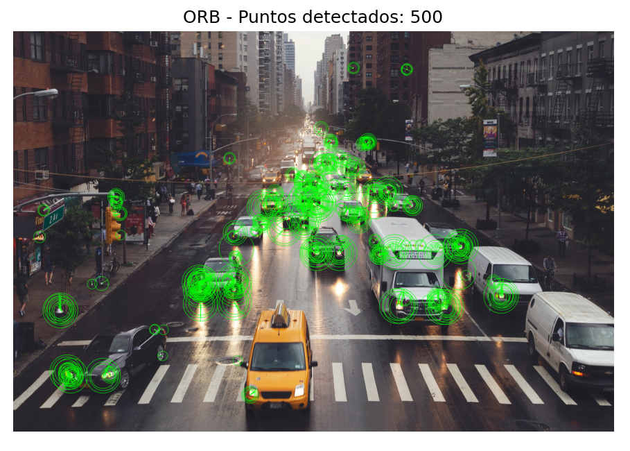
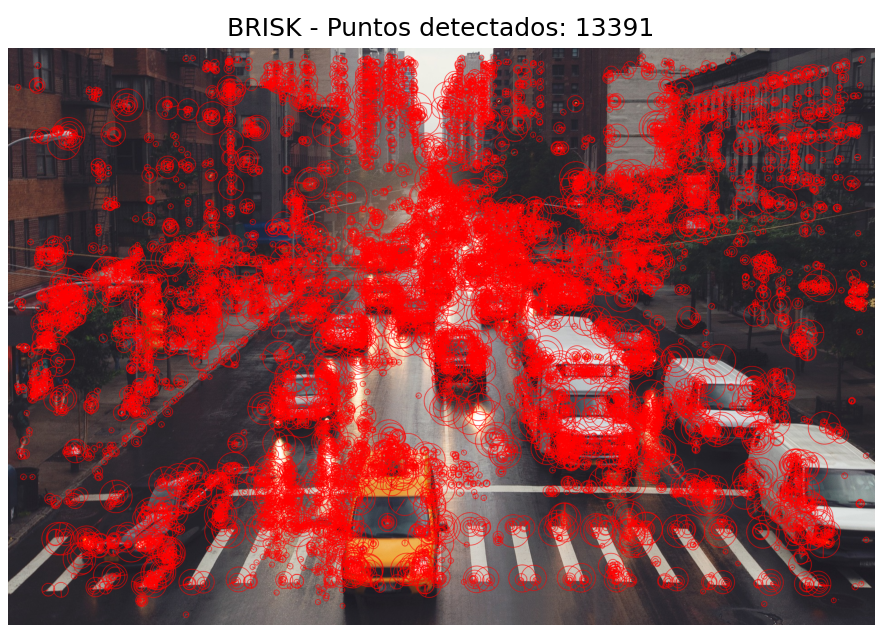
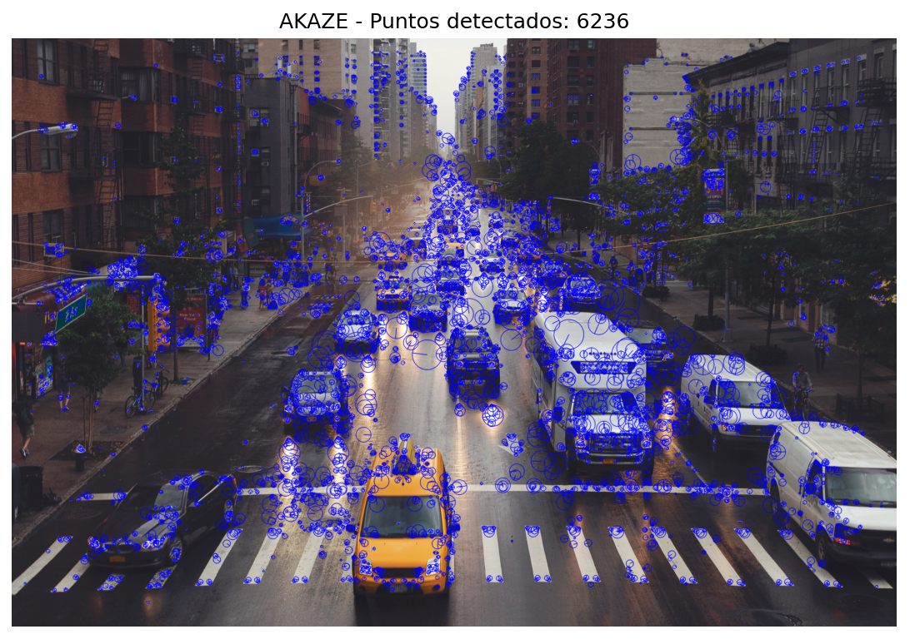

# Práctica de Laboratorio: Reconocimiento de Características en Imágenes

## Contextualización

En esta práctica se desarrolló un ejercicio de visión por computadora enfocado en la detección de características dentro de imágenes digitales. Este tipo de procesamiento es fundamental en áreas como la realidad aumentada, la inteligencia artificial y las interfaces inteligentes.

El objetivo principal fue analizar cómo diferentes algoritmos permiten a un sistema identificar puntos clave en una imagen, simulando el funcionamiento de tecnologías modernas que reconocen objetos, patrones y entornos.

## Objetivo

Comparar el funcionamiento de tres algoritmos de detección de características (ORB, BRISK y AKAZE) aplicados a una imagen seleccionada, evaluando la cantidad de puntos detectados y su comportamiento.

## Algoritmos utilizados

### 🔸 ORB (Oriented FAST and Rotated BRIEF)
Es un algoritmo eficiente y rápido para la detección de puntos clave en imágenes. ORB combina el detector FAST y el descriptor BRIEF, permitiendo identificar características relevantes como esquinas y bordes. Es ampliamente utilizado en aplicaciones en tiempo real debido a su bajo costo computacional.

### 🔸 BRISK (Binary Robust Invariant Scalable Keypoints)
BRISK es un algoritmo que detecta una gran cantidad de puntos clave en una imagen. Se caracteriza por ser más sensible a los detalles, lo que permite identificar muchas más características, aunque puede generar saturación visual y mayor consumo de recursos.

### 🔸 AKAZE (Accelerated KAZE)
AKAZE es un algoritmo que ofrece un equilibrio entre precisión y rendimiento. Detecta una cantidad moderada de puntos clave, manteniendo buena estabilidad frente a cambios en la imagen. Es útil cuando se requiere un balance entre velocidad y calidad de detección.

El desarrollo de la práctica se realizó en Python utilizando la librería OpenCV para el procesamiento de imágenes y Matplotlib para la visualización de resultados.

